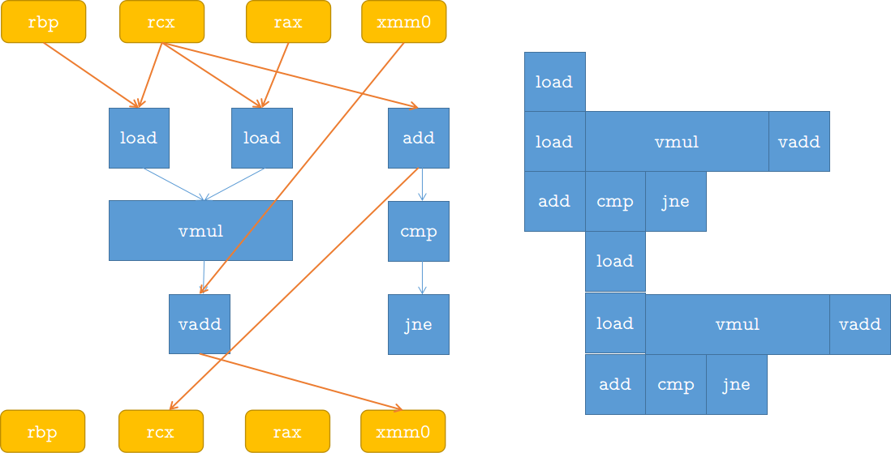

# 5.11

使用另一种形式来计算最长路径，主要分为以下3个步骤。

1. 给出用到的指令数目。
2. 画出指令之间的数据依赖图。
3. 排列指令，计算最长路径。

指令数据包括。

1. 两条$load$指令，分别从内存中读取数组$u$和$v$中的元素。
2. 一条$vmul$乘法指令，计算当前元素的内积。
3. 一条$vadd$指令，把当前元素的内积加到$sum$中。
4. 一条$add$指令，增加循环变量的值。
5. 一条比较指令$cmp$和一条条件跳转指令$jne$，用来控制循环的执行。

这些指令之间的依赖关系图如下。

从图中可以看出，关键路径有两条，分别是xmm0-->vadd-->xmm0，以及rcx-->add-->rcx。所以整个程序的CPE受限于加法的性能。